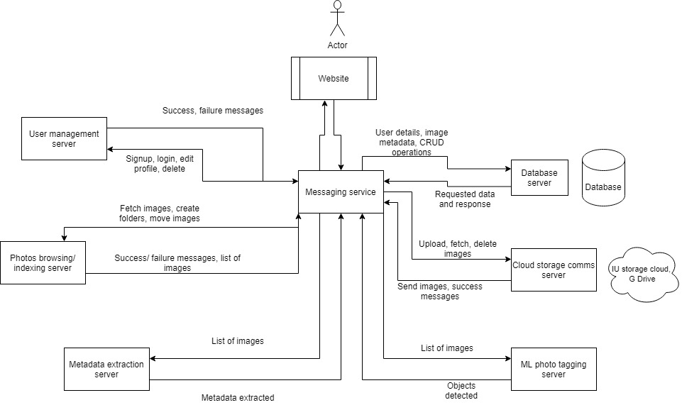

# PixelSquad: Project Overview
User can login to the application host server and can upload the photos to cloud server and download the photos that are already uploaded. Photos are stored at the cloud server and account information is also stored in a database. User can provide access to other users to share the photos that are stored in the cloud.

## Team:
Vivek:
Currently pursuing Master’s in Data Science at Indiana University, worked for 4 years as a Data Scientist at Predera. Also, got to work on the company’s flagship product as a Python Developer.

Sahiba:
Currently pursuing Master’s in Computer Science at Indiana University. Have 5.9 years of professional work experience at Accenture and Fidelity. Passionate to learn new languages and skills.

Deepika:
Currently pursuing Master’s in Computer Science at Indiana University. Have 8 years of work experience at TCS, HSBC, Nvizion Solutions, Delhivery and HERE technologies.

## Napkin Diagram
(docs/Napkin Diagram.png)

## Architecture diagram

Team members:

1. [Deepika Awasthi](https://github.com/danagar0312)
2. [Sahiba Mittal](https://github.com/SahibaM)
3. [Vivek Karna](https://github.com/vivekka93)
