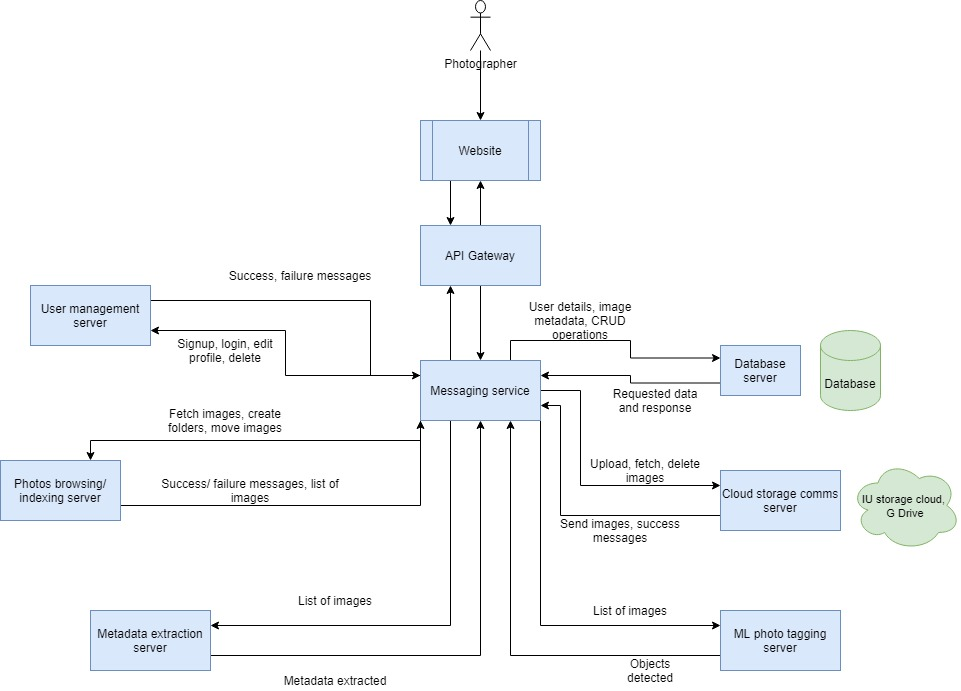

# PixelSquad: Project Overview
User can login to the application host server and can upload the photos to cloud server and download the photos that are already uploaded. Photos are stored at the cloud server and account information is also stored in a database. User can provide access to other users to share the photos that are stored in the cloud.

## Napkin Diagram
!https://github.com/airavata-courses/PixelSquad/blob/master/wiki_images/Napkin_Diagram.PNG!

## Architecture diagram

Team members:

1. [Deepika Awasthi](https://github.com/danagar0312)
Currently pursuing Master’s in Computer Science at Indiana University. Have 8 years of work experience in major frameworks and programming practices such as Java, Enterprise Development,Django, Spark, Flink, Mongo DB and AWS.

2. [Sahiba Mittal](https://github.com/SahibaM)
Currently pursuing Master’s in Computer Science at Indiana University. Have 5.9 years of professional work experience as data analyst at Accenture and Fidelity. Have hands on experience in Informatica powercenter, SQL, UNIX,JAVA,Control-M,React and Node.

3. [Vivek Karna](https://github.com/vivekka93)
Currently pursuing Master’s in Data Science at Indiana University, worked for 4 years as a Data Scientist at Predera. Also, got to work on the company’s flagship product as a Python Developer.
