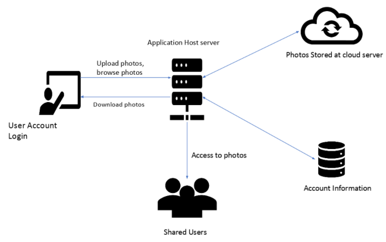

**#Develop branch contains all the code 
**# PixelSquad: Project Overview
PixelSquad aims to provide users the ability to store their images in a cloud environment 
and be able to share their images with their friends and peers. With the use of several
advanced technologies, metadata and the information present in the images are extracted and
are then leveraged to enable searching based on this information.

## Napkin Diagram

### Architecture diagram

Team members:

1. [Deepika Awasthi](https://github.com/danagar0312)
Currently pursuing Master’s in Computer Science at Indiana University.Working experience in frameworks and programming languages such as Java Enterprise Development,Django, Spark, Flink, Mongo DB and AWS.

2. [Sahiba Mittal](https://github.com/SahibaM)
Currently pursuing Master’s in Computer Science at Indiana University. Have 5.9 years of professional work experience as data analyst at Accenture and Fidelity. Have hands on experience in Informatica powercenter, SQL, UNIX,JAVA,Control-M,React and Node.

3. [Vivek Karna](https://github.com/vivekka93)
Currently pursuing Master’s in Data Science at Indiana University, worked for 4 years as a Data Scientist at Predera. Also, got to work on the company’s flagship product as a Python Developer.
